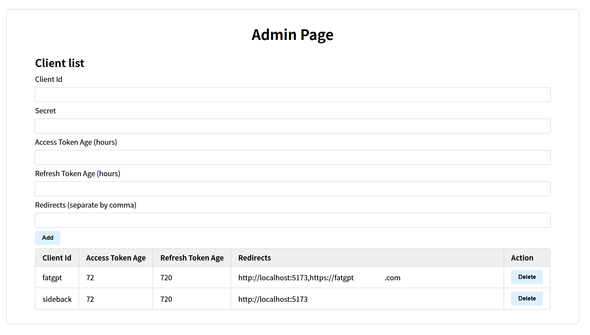

# MyOAuth

Self-hosted OAuth2.0/OIDC provider, with PKCE support.

Note: This is the side-project of other side-projects, coding style is bad.

## Setup

### Back End

Edit `conf.json` to configure the backend-related settings.

Generate RSA keys (defaults to `conf.json` `rsaPrivateKeyPath` so it works
without extra key-path configuration):

```shell
./gen_rsa.sh
```

```shell
go build .
./myoauth
```

### Front End

Edit `.env` to point to the actual backend service endpoint.

```shell
npm ci
npm run build
```

## Screenshot



## OIDC Endpoints

- Discovery: `/.well-known/openid-configuration`
- JWKS: `/.well-known/jwks.json`
- Authorization endpoint: `/authorize` (Authorization Code + PKCE S256)
- Token endpoint: `/token` (`authorization_code` and `refresh_token` grants)
- UserInfo endpoint: `/userinfo`
- Login submit endpoint for hosted login page: `/auth/login`

`conf.json` now supports these OIDC-related fields:

- `oidcIssuer`: issuer used in discovery + JWT issuer claim
- `oidcLoginUrl`: hosted login page URL used by `/authorize`

## Usage

Recommend using `sdks`.
