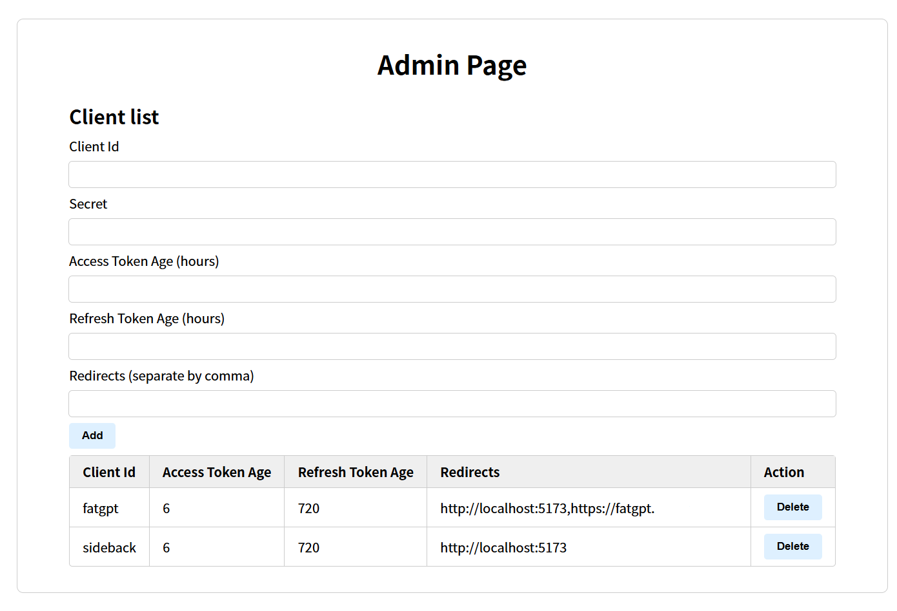

# MyOAuth

Self-hosted OAuth2.0 implementation, with PKCE support.

Note: This is the side-project of other side-projects.

## Setup

### Back End

Edit `conf.json` to configure the backend-related settings.

```shell
go build .
./myoauth
```

### Front End

Edit `.env` to point to the actual backend service endpoint.

```shell
npm ci
npm run build
```

## Screenshot



## API

Due to being too lazy to write docs, please refer to the `e2e` folder.

## Usage

Recommend using `sdks`.
